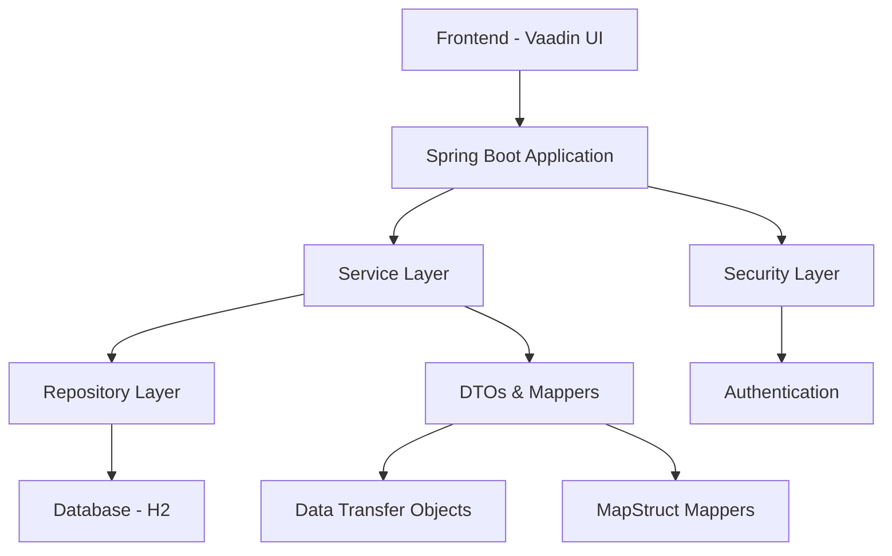

# Sparkauto CRM Application

Sparkauto CRM is a comprehensive Customer Relationship Management (CRM) application built with modern Java technologies. This application helps Sparkauto automotive service centers manage clients, orders, and work assignments efficiently.

## Features

- **Client Management**: Store and manage client information including personal details, contact information, and vehicle data
- **Order Management**: Create and track service orders with detailed work assignments
- **Work Tracking**: Manage different types of work with hours and pricing information
- **User Authentication**: Role-based access control (ADMIN role)
- **Database Integration**: Built-in H2 database for development and easy migration to production databases
- **Responsive UI**: Modern web interface built with Vaadin Framework

## Technologies Used

- **Backend**: Spring Boot, Spring Data JPA, Spring Security, MapStruct
- **Frontend**: Vaadin Framework (Java-based UI components)
- **Database**: H2 (in-memory) for development, easily configurable for production
- **Build Tool**: Maven
- **Containerization**: Docker support

## Prerequisites

- Java 25
- Maven
- Docker (for containerized deployment)

## Getting Started

### Development Mode

1. Clone the repository
2. Import the project into your IDE (IntelliJ IDEA, Eclipse, etc.)
3. Run the `Application` class
4. Alternatively, run from the command line:

   ```bash
   ./mvnw
   ```

### Production Build

To build the application in production mode:

```bash
./mvnw -Pproduction package
```

### Docker Deployment

To build a Docker image:

```bash
docker build -t sparkauto:latest .
```

## Project Structure

```text
src/
├── main/
│   ├── java/ru/oldzoomer/
│   │   ├── Application.java          # Main application class
│   │   ├── model/                    # Data models (Client, Order, Work)
│   │   ├── repository/               # Data access layer (JPA repositories)
│   │   ├── service/                  # Business logic layer
│   │   ├── dto/                      # Data Transfer Objects for API communication
│   │   ├── mapper/                   # MapStruct mappers between entities and DTOs
│   │   ├── security/                 # Security configuration
│   │   └── view/                     # UI views and navigation
│   └── resources/
│       └── application.properties    # Application configuration
└── test/
    └── java/ru/oldzoomer/            # Test classes
```

## Database Schema

The application uses a simple relational database schema with the following entities:

- **Clients**: Stores client information (name, surname, middle name, VIN, phone, email)
- **Orders**: Represents service orders linked to clients
- **Works**: Defines different types of work with hours and pricing
- **Order-Works**: Junction table for many-to-many relationship between orders and works

## Security Configuration

The default admin user is:

- Username: `admin`
- Password: `admin`

## Architecture Overview

The application follows a layered architecture pattern:

1. **Presentation Layer**: Vaadin-based UI components for user interaction
2. **Controller Layer**: Spring MVC controllers managing HTTP requests
3. **Service Layer**: Business logic implementation with validation
4. **Repository Layer**: Data access using Spring Data JPA
5. **Model Layer**: JPA entities representing database schema

## Component Diagram



## Acknowledgments

- Built with [Vaadin](https://vaadin.com/)
- Powered by [Spring Boot](https://spring.io/projects/spring-boot)
